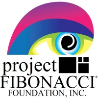

# Hi there, I'm Muhammad 👋 a recent CS grad from CUNY Hunter College!

## I'm a Software Engineer, Film Photographer, Cat Dad, and Amateur Cook
### I've worked as a Full Stack Engineer, Backend Engineer, Data Engineer, Project Manager, and Pharmacy Technician

### Here's some of the projects/technologies I've worked on:
  * [Investment Simulator App](https://github.com/tanveerm176/FICS-Compose) using Kotlin and Jetpack Compose
  * [RAG Web App](https://syntaxsorcerer.vercel.app/) with TypeScript, React, NextJS, and Pinecone for a vector db
  * [ML Covid Data Analysis](https://github.com/tanveerm176/Covid-Subway-Analysis) with Tableau, Python, Numpy, and Sci-Kit Learn
  * [Deep Learning Image Classification model](https://github.com/tanveerm176/CNN_ImageClassification) with TensorFlow Keras
  * [Breast Cancer Research](https://github.com/tanveerm176/CancerResearch) with Python, PyMOL, AutoDock Vina, and Marvin Sketch

### Projects in Progress:
  * Health Tracker using Kotlin Multiplatform / React
  * Plant App for mom to log and take care of her plants 
  * 3D Game using Unity and C#

### Feel free to connect with me:

&nbsp;&nbsp;

&nbsp;&nbsp;

### Languages and Tools:

 
 

### Organizations where I am a member:

&nbsp;&nbsp;

&nbsp;&nbsp;

&nbsp;

